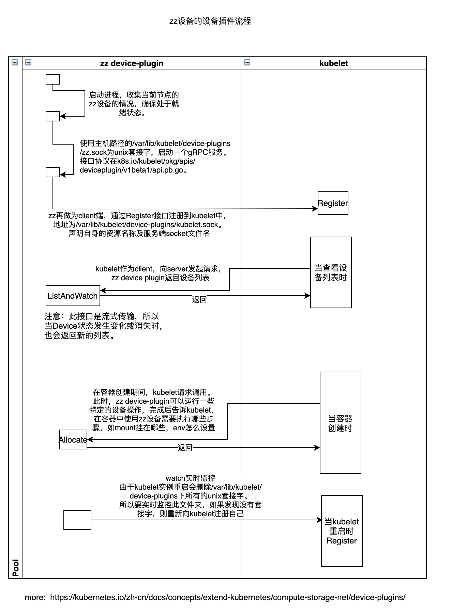

# k8s-deviceplugin-demo

## 目的
此项目目的为初学者了解deviceplugin的基本运行原理，一切以最简单为原则。

## 设计目标
deviceplugin可以通过k8s daemonset形式运行在每个node节点上，也可以手动在每个节点运行二进制，这里用最原始模式。

1、假设集群中有两个节点有mockgpu这个硬件2套，分别在这两个节点运行./mockgpu。
2、查看k8s node资源，会发现4个zbx.com/mockgpu资源。 
3、创建pod，使用1个该资源。 会发现pod会在该节点创建，并且总资源数-1。

其中deviceplugin的设备插件流程图：



## 编译
```shell
CGO_ENABLED=0 GOOS=linux GOARCH=amd64 go build -o mockgpu  ./cmd/*.go
```


## 使用
```shell
# 简单运行
$ ./mockgpu

# 查询k8s资源，发现已经上报该资源。
$ kubectl describe node node1 
Capacity:
  zbx.com/mockgpu:    2
Allocatable:
  zbx.com/mockgpu:    0

# 创建pod使用资源
$ cat > pod.yaml << EOF
apiVersion: v1
kind: Pod
metadata:
  name: gpu-pod
spec:
  containers:
    - name: ubuntu-container
      image: busybox   # 使用busybox代替
      command: ["bash", "-c", "sleep 86400"]
      resources:
        limits:
          zbx.com/mockgpu: 1 # 请求1个vgpu 
EOF

$ kubectl apply -f pod.yaml

```

## 贡献
```shell
# 预先执行代码格式化与代码规范检查
$ gofmt  -w -l ./
$ staticcheck ./...
```